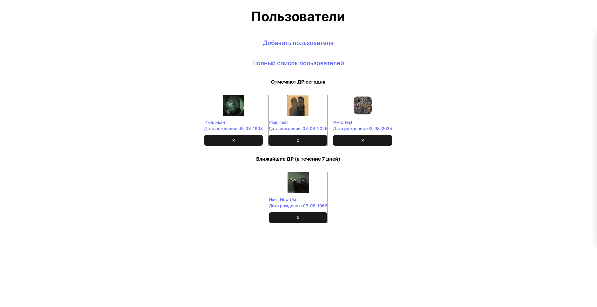
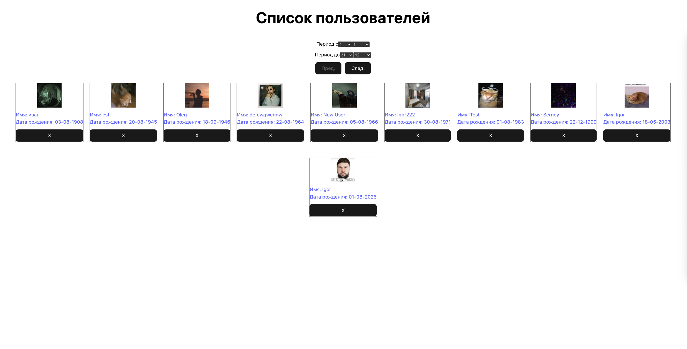
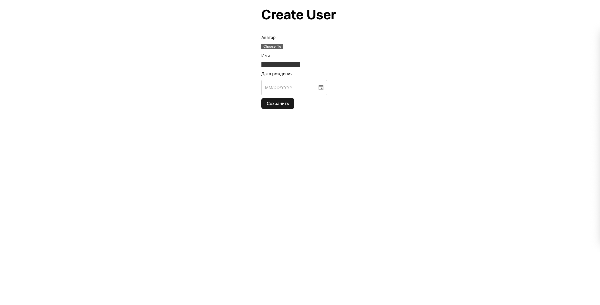

# "Поздравлятор"

Функциональность приложения - ведение списка дней рождения (далее ДР) друзей/знакомых/сотрудников, а именно:

#### Отображение списка сегодняшних и ближайших ДР

#### Отображение всего списка ДР

#### Добавление записей в список ДР

#### Удаление записей из списка ДР

#### Редактирование записей в списке ДР

Решение представляет собой SPA веб-приложение, сервер предоставляет АПИ ([ASP.NET](http://asp.net/) Core Web API), информация хранится в объектах, персистентность которых реализуется с помощью использования БД. Корневая страница выводит список сегодняшних и ближайших ДР, остальная функциональность доступна на отдельных страницах, ссылки на которые ведут с корневой. Было реализовано хранение и отображение фотографий именинников.

## Корневая страница

## Страница Списка пользователей

## Страница добавления пользователя

